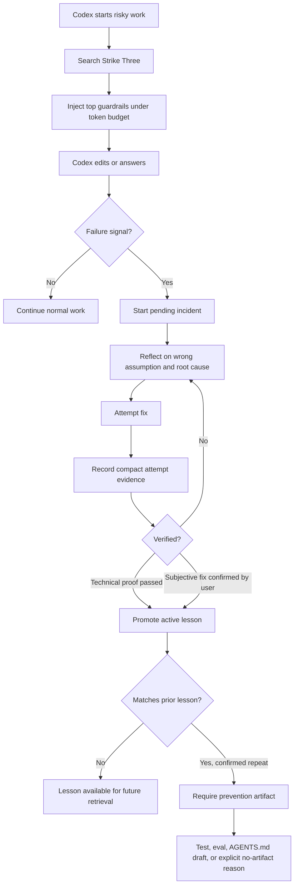
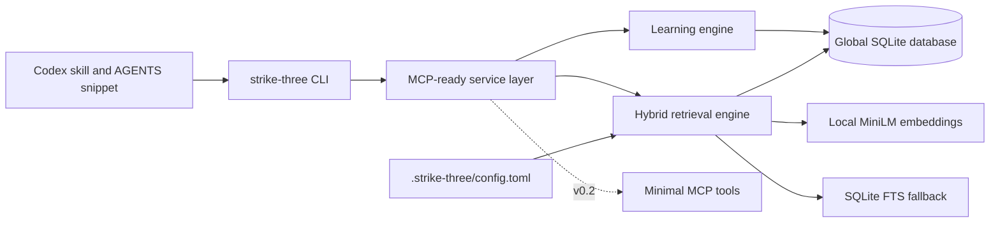

# Strike Three

Verified mistake memory for Codex.

Strike Three helps Codex learn from verified mistakes without retraining the model. It records clear failures, verifies the fix, turns the lesson into a compact future guardrail, and retrieves that guardrail before similar work.

## What It Does

- Detects clear failure signals such as "this is broken," failed tests, rejected fixes, or wrong assumptions.
- Creates a pending incident before the evidence disappears.
- Records compact fix attempts: hypothesis, change summary, verification result, and failure reason.
- Promotes lessons only after technical proof or user confirmation.
- Retrieves the top few relevant guardrails before risky Codex work.
- Escalates confirmed repeats into tests, evals, or AGENTS.md rule drafts.

## Workflow



## Architecture



## v0.1 Scope

Build a TypeScript CLI plus Codex skill:

- `strike-three search`
- `strike-three incident start`
- `strike-three attempt add`
- `strike-three lesson promote`
- `strike-three repeat confirm`
- `strike-three review`
- `strike-three config`

v0.1 stores lessons in a global SQLite database. Projects can add `.strike-three/config.toml` to filter or opt out of global retrieval.

## First-Time Developer Path

```bash
npm install -g strike-three
strike-three config init
strike-three search "fixing a failing Next.js middleware test"
```

Expected first win: Codex sees one or two relevant guardrails before making a risky change, not a wall of memory.

## Design Principles

- Mistake-first, not memory-first.
- Verification before promotion.
- Short guardrails, not full history.
- Local embeddings by default.
- BM25/FTS fallback always available.
- Tests and evals beat vague memory.
- AGENTS.md rules are proposed, not auto-applied.

## Design Spec

See [docs/superpowers/specs/2026-05-20-strike-three-design.md](docs/superpowers/specs/2026-05-20-strike-three-design.md).
