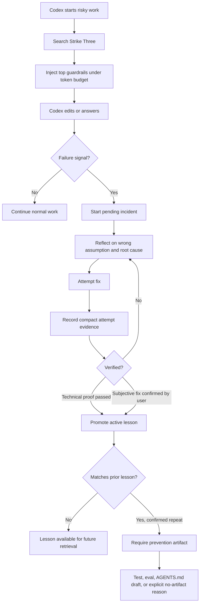
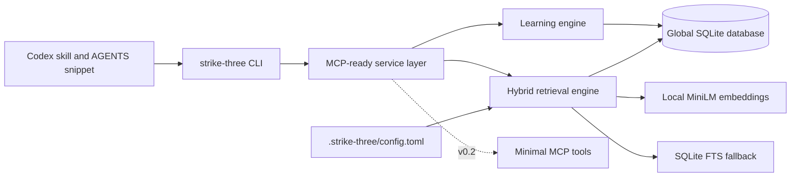

# Strike Three Design

Date: 2026-05-20

## Summary

Strike Three is a verified mistake memory system for Codex. It does not retrain Codex. It gives Codex an external self-correction loop: detect a clear failure, analyze the cause, verify the fix, store a compact guardrail, and retrieve that guardrail before similar future work.

The product is mistake-first, not memory-first. It stores verified lessons, tracks failed attempts, detects repeated failure patterns, and pushes repeated mistakes toward tests, evals, or AGENTS.md rule drafts.

## Goals

- Help Codex learn from verified mistakes across projects.
- Create pending incidents automatically on clear failure signals.
- Promote lessons only after technical proof or user confirmation.
- Retrieve only relevant guardrails under a small token budget.
- Track repeated mistakes and require prevention artifacts when practical.
- Keep v0.1 small enough to ship as a TypeScript CLI plus Codex skill.

## Non-Goals

- Model retraining.
- MCP server in v0.1.
- Web dashboard.
- Graph memory.
- Generic agent memory.
- Full log or diff capture by default.
- Automatic AGENTS.md edits.

## Product Name

- Product: Strike Three
- CLI: `strike-three`
- Tagline: Verified mistake memory for Codex.

The name refers to escalation on repeated mistakes. The first verified mistake creates an active lesson. A confirmed repeat requires a prevention artifact when practical. Further repeats become evidence of a systemic guardrail failure.

## Architecture

Strike Three v0.1 has these components:

- TypeScript CLI binary: `strike-three`
- Global SQLite database in the user's data directory
- Optional project policy file: `.strike-three/config.toml`
- Retrieval engine using local MiniLM embeddings with SQLite FTS fallback
- Learning engine for incidents, attempts, lessons, and repeats
- Codex skill that defines when Codex searches, logs, verifies, and promotes lessons
- Optional global AGENTS.md snippet that reminds Codex to use Strike Three
- MCP-ready internal service layer for a later v0.2 MCP server

The CLI and skill are the v0.1 product. MCP is intentionally deferred until the learning loop and injected guardrail format are proven.

### Module Boundaries

The TypeScript implementation should keep these modules separate:

- `cli`: argument parsing, terminal output, JSON output, and process exit codes
- `services`: stable application functions that the CLI calls and MCP can later expose
- `storage`: SQLite schema, migrations, transactions, and repository methods
- `retrieval`: embedding generation, vector ranking, FTS fallback, reranking, and token budgeting
- `learning`: incident lifecycle, attempt recording, lesson promotion, and repeat confirmation rules
- `policy`: global settings and project `.strike-three/config.toml` loading
- `skill`: packaged Codex skill instructions and AGENTS.md snippet templates

The CLI must not reach into database tables directly. It should call service functions only. That keeps v0.2 MCP small because the MCP tools can call the same service functions.

### Visual Workflow



### System Architecture Diagram



## Data Model

### Incident

An incident is created immediately when Codex detects a clear failure signal.

Fields:

- `id`
- `status`: `pending`, `verified`, `failed`, `ignored`
- `failure_signal`: user correction, failed test, failed build, rejected fix, or wrong assumption
- `task_summary`
- `project_path`
- `project_name`
- `files`
- `languages`
- `frameworks`
- `created_at`

### Attempt

An attempt records compact evidence from a fix attempt.

Fields:

- `id`
- `incident_id`
- `hypothesis`
- `change_summary`
- `verification_command`
- `verification_result`
- `failure_reason`
- `created_at`

Strike Three does not store full diffs or logs by default. Attempts capture enough evidence to understand what was tried and why it did or did not work.

### Lesson

A lesson is created or promoted only after verification.

Fields:

- `id`
- `title`
- `failure_pattern`
- `root_cause`
- `wrong_assumption`
- `correct_behavior`
- `future_guardrail`
- `verification`
- `scope`: languages, frameworks, files, and task type
- `confidence`
- `repeat_count`
- `status`: `active`, `deprecated`, `superseded`
- `created_from_incident`
- `created_at`
- `updated_at`

The `future_guardrail` field is the primary retrieval payload. It must describe what Codex should do differently next time.

### Repeat

A repeat is recorded only after a semantic match is confirmed.

Fields:

- `id`
- `lesson_id`
- `incident_id`
- `match_reason`
- `confirmed_by`: user or Codex verification
- `prevention_artifact`: test, eval, AGENTS.md draft, or none with reason
- `created_at`

## Learning Loop

### Pre-Task Retrieval

Before risky work, Codex searches Strike Three for relevant lessons. Risky work includes bug fixes, test failures, refactors, dependency changes, config changes, and unfamiliar code paths.

### Failure Detection

Codex enters mistake mode only on clear signals:

- The user says the work is broken, wrong, failing, buggy, or does not work.
- A test, build, typecheck, or lint command fails.
- The user rejects a fix.
- Codex identifies a concrete wrong assumption.

Normal implementation iteration should not create incidents unless one of these signals appears.

### Pending Incident

On failure detection, Codex creates a pending incident immediately. This preserves the failure context before the fix changes the evidence.

### Root-Cause Reflection

Before promoting a lesson, Codex must identify:

- wrong assumption
- missing check
- root cause
- correct behavior
- future guardrail

The lesson is not useful unless it changes future behavior.

### Fix Attempts

After each attempted fix, Codex records an attempt with compact evidence. Failed attempts remain attached to the incident and help avoid repeating the same bad fix.

### Promotion

A pending incident becomes an active lesson only when verified:

- Technical failures can be verified by a relevant passing test, build, typecheck, lint, or smoke check.
- Subjective or product failures require user confirmation.

If no proof exists and a proof can reasonably be created, Codex should prefer creating a test or check before promotion.

### Repeat Handling

If a future incident semantically matches an active lesson, Strike Three suggests a repeat. The repeat count changes only after confirmation.

On confirmed repeat, Codex must add or propose a prevention artifact when practical:

- Technical regression: test.
- Answer or reasoning failure: eval case.
- Workflow failure: AGENTS.md rule draft.
- No suitable artifact: explicit reason recorded.

AGENTS.md edits are never applied automatically in v0.1. Strike Three can draft the change and ask for approval.

## Retrieval

Strike Three uses hybrid retrieval from day one.

Primary retrieval:

- Embed verified lessons using a local MiniLM provider.
- Search by semantic similarity against task summary, user prompt, error text, repository metadata, and file paths.
- Rerank results with scope metadata such as language, framework, project, path, and task type.

Fallback retrieval:

- SQLite FTS over title, failure pattern, root cause, wrong assumption, correct behavior, guardrail, tags, framework, language, and paths.

Injection rules:

- Return compressed guardrails, not full lessons.
- Default maximum: 3 lessons.
- Default budget: about 600 tokens.
- Include lesson IDs for later used, repeated, or prevented tracking.

Example output:

```text
Strike Three guardrails:
- ST-12: When editing Next.js middleware, verify matcher and edge runtime limits before changing request handling. Proof: middleware tests or authenticated route smoke test.
- ST-19: When a test fixture depends on generated IDs, inspect factory defaults before asserting exact values.
```

Embedding providers:

- Local MiniLM is the default.
- Optional providers such as OpenAI or Voyage can be added behind the same provider interface.
- SQLite FTS remains available even when embeddings are unavailable.

## CLI

v0.1 CLI commands:

- `strike-three search`
- `strike-three incident start`
- `strike-three attempt add`
- `strike-three lesson promote`
- `strike-three repeat confirm`
- `strike-three review`
- `strike-three config`

The CLI should support JSON output so Codex can consume results reliably. Human-readable output can exist for direct terminal use.

### First-Time Developer Experience

The first run should prove value quickly:

```bash
npm install -g strike-three
strike-three config init
strike-three search "fixing a failing Next.js middleware test"
```

The expected first win is one or two relevant guardrails before a risky task, not a long memory dump.

CLI output requirements:

- Default human output must explain the next action in one short sentence.
- `--json` output must be stable and documented.
- Search output must show why each lesson matched.
- Empty search results must say how to create the first lesson.
- Verification failures must explain what proof is missing.
- Repeat confirmation must name the prevention artifact requirement.

## Codex Skill Behavior

The Strike Three skill instructs Codex to:

- Run `strike-three search` before risky work.
- Run `strike-three incident start` on clear failure signals.
- Run `strike-three attempt add` after each attempted fix.
- Run `strike-three lesson promote` after verified technical proof.
- Ask the user before promoting subjective or product lessons.
- Run `strike-three repeat confirm` when a retrieved lesson appears to have been violated again.
- Create or propose a prevention artifact on confirmed repeats.

The skill should keep injected lessons short and should not paste full memory history into context.

## Global AGENTS.md Snippet

Strike Three can provide a short snippet for global AGENTS.md:

- Search Strike Three before risky tasks.
- Enter mistake mode on clear failure signals.
- Log compact attempts.
- Promote only after verification.
- Require prevention artifacts on confirmed repeats.

The snippet should not contain stored lessons. Lessons stay in the database and are retrieved on demand.

## MCP-Ready Internal API

v0.1 should expose internal service functions that can later become MCP tools:

- `searchLessons(input)`
- `startIncident(input)`
- `addAttempt(input)`
- `promoteLesson(input)`
- `confirmRepeat(input)`

v0.2 MCP should keep a small tool surface, likely one search tool and one record tool, to avoid token overhead.

## Project Policy

Projects can add `.strike-three/config.toml` to control global retrieval.

Policy options should include:

- enable or disable global lessons for the project
- include or exclude tags
- include or exclude languages and frameworks
- define local-only scopes
- set retrieval token budget and max lesson count

The global store remains the default. Project policy prevents cross-project noise and privacy surprises.

## Metrics

Strike Three should track:

- lessons retrieved per task
- tokens injected
- lessons used or ignored
- repeated mistakes
- confirmed prevented mistakes
- prevention artifacts created
- verification commands run
- time from failure signal to verified lesson

The tool is worth keeping if reduced repeated mistakes justify the token and workflow cost.

## Plan Review Findings

This design was reviewed through three lenses before implementation planning.

### Engineering Review

Findings applied:

- Add explicit module boundaries so CLI, service, storage, retrieval, learning, policy, and skill packaging can evolve independently.
- Keep CLI calls behind service functions so MCP can reuse the same API later.
- Treat embedding failures as non-fatal because FTS remains available.
- Require transactional promotion from incident to lesson so partially promoted lessons cannot corrupt retrieval.
- Test repeat confirmation as a first-class workflow, not an analytics-only event.

### Developer Experience Review

Findings applied:

- Add a first-time developer path to show the expected "hello world."
- Require JSON output for Codex and readable output for humans.
- Require clear empty states, especially before any lessons exist.
- Include match reasons in search results so users trust retrieved guardrails.
- Keep installation and first search short enough to be tried inside a normal Codex session.

### Design Review

Findings applied:

- Add README diagrams for the learning loop and system architecture.
- Lead with the product promise before implementation details.
- Make the non-goal clear: this is not model retraining and not generic memory.
- Show escalation visually so "Strike Three" is understandable from the first screen.
- Keep docs dense and practical because the target user is a developer installing a tool, not a marketing audience.

## Testing

Required tests:

- schema validation
- lesson promotion rules
- repeat confirmation rules
- FTS fallback search
- embedding provider interface with deterministic fake provider
- CLI flow: incident start, failed attempt, successful attempt, lesson promotion
- CLI flow: compressed search output under budget
- CLI flow: repeat confirm requires prevention artifact or explicit no-artifact reason

Manual skill scenarios:

- user says the result is wrong
- test fails
- subjective bug requires user confirmation
- repeated lesson triggers prevention artifact

## Approved v0.1 Scope

Build the TypeScript CLI, global SQLite store, hybrid retrieval, Codex skill, AGENTS snippet, and MCP-ready service layer. Do not build MCP, dashboard, graph memory, or automatic AGENTS.md edits in v0.1.
